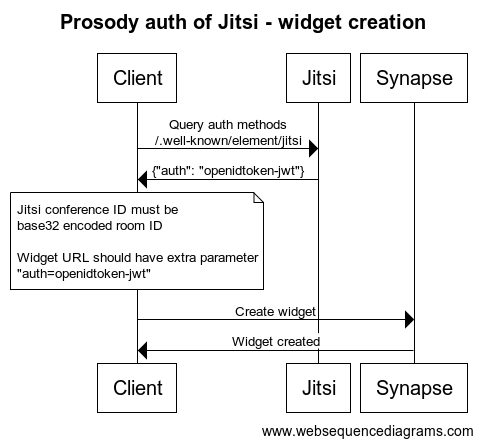
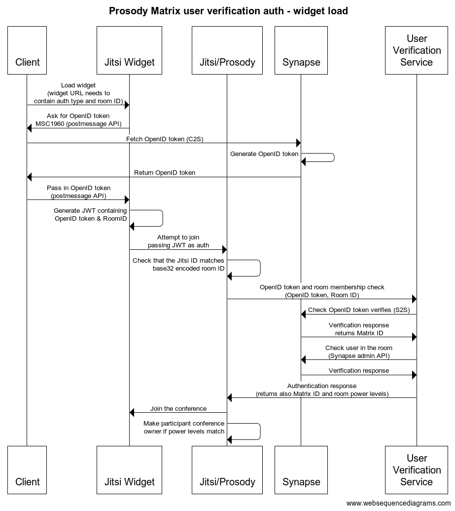

# Prosody Auth Matrix User Verification

Matrix user verification auth for Prosody for Jitsi Meet widget usage.

## Description

Prosody auth for glue between Jitsi widgets utilizing the Jitsi Meet external API 
and [Matrix user verification service](https://github.com/matrix-org/matrix-user-verification-service)
to handle verifying a given Matrix user exists and that they are in a room that
matches the Jitsi room ID.

Additionally, can make the verified user an owner of the conference if power level
syncing has been turned on.

## Flow diagrams

These diagrams explain how the different components fit together around these Prosody modules.

### Jitsi widget creation


            
### Widget load


              
## Usage

### Widget initialization

When loading the Jitsi widget, the Jitsi Meet external API should be 
initialized with the following options:

* `roomName`: base32 encoded Matrix room ID to check the user is in (without padding)
* `jwt`: a JWT token, example;

```json
{
  "context": {
    "user": {
      "avatar": "https:/gravatar.com/avatar/abc123",
      "name": "John Doe"
    },
    "matrix": {
      "token": "DX81zuBbR1Qt7WGnyiIQYdqbDSm2ECnx",
      "room_id": "!qwertyasdfgh:matrix.org",
      // OPTIONAL
      "server_name": "matrix.org"
    }
  },
  "aud": "jitsi",
  "iss": "issuer",
  "sub": "jitsi.example.com",
  "room": "*"
}
```

For generating the token, note the following:

* `content.user` will be used for the Jitsi Meet session.
* `matrix.token` is an OpenID token from the Matrix C2S API, see [here](https://matrix.org/docs/spec/client_server/r0.6.1#id154).
* `matrix.room_id` should be the Matrix room ID we want to check the user is in. When base32 encoded (without padding) it must match the Jitsi room ID.
* `matrix.server_name` (optional) is the server name the `matrix.token` relates to. If not given, we assume UVS will be configured for a single server.
* `aud` can be for example "jitsi", should match Prosody token auth issuers/audience if needed.
* `iss` issuer of the token, must match `app_id` below in Prosody config.
* `sub` should be the Jitsi Meet domain.
* `room` is not used at the moment, a `*` works here.

NOTE! The JWT can be signed with any kind of secret string. The backend Prosody module
does not verify the signature, we're only interested in passing data through Jitsi to the
Prosody module piggybacking on the token auth mechanism.

### Jitsi auth well-known

On the Jitsi Meet domain, you'll need to host a `/.well-known/element/jitsi` 
JSON file containing the following:

```json
{"auth": "openidtoken-jwt"}
```

### Matrix User Verification service

An instance of [Matrix user verification service](https://github.com/matrix-org/matrix-user-verification-service)
needs to be running and configured to point to the same Synapse server that issues
the OpenID tokens.

### Prosody configuration and plugins

Add the auth to your Jitsi Meet Prosody virtualhost section:

```lua
VirtualHost "example.com"
    authentication = "matrix_user_verification"

    -- Must be set for the auth token to be passed through
    -- Must match what is being set as `iss` in the JWT
    app_id = "issuer"

    -- Base URL to the matrix user verification service (without ending slash)
    uvs_base_url = "https://uvs.example.com"
    -- (optional) UVS auth token, if authentication enabled
    -- Uncomment and set the right token if necessary
    --uvs_auth_token = "changeme"
    -- (optional) Make Matrix room moderators owners of the Prosody room.
    -- Enabling this will mean once a participant, authed using this module,
    -- joins a call, their power in the relevant Matrix room will be checked
    -- via UVS and if they have more or equal the configured power here,
    -- they will be made an owner of the Prosody room.
    -- This is disabled by default, uncomment with a sufficient level below.
    --uvs_sync_power_levels = true
```

If you want to sync power levels (ie have `uvs_sync_power_levels` above enabled), 
you'll also need to add the power level module to your MUC config, for example as follows:

```lua
Component "conference.example.com" "muc"
    modules_enabled = {
        "matrix_power_sync";
    }
```

Copy the `mod_auth_matrix_user_verification.lua` and (if needed) `mod_matrix_power_sync.lua`
files to your Prosody plugins folder.

### Prosody image

The prosody image needs to have the Lua module `http` installed. Install it with LuaRocks:

```
luarocks install http
```

A Dockerfile [also exists](https://github.com/matrix-org/docker-jitsi-meet/releases/tag/stable-4857-ems.1) with this built in.

## License

Apache 2.0
